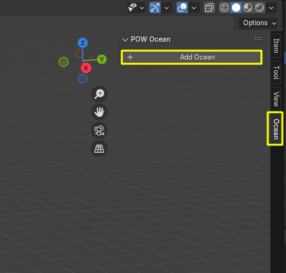
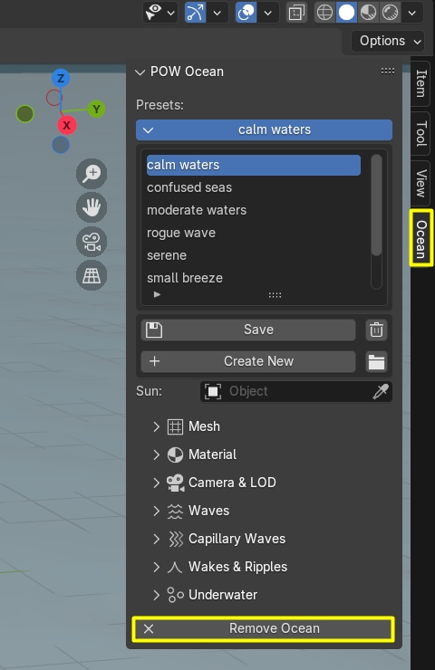
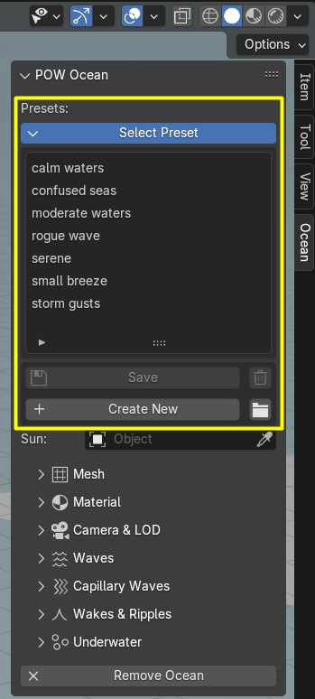

# Getting started

_Physical Open Waters_ (POW) is a Blender add-on for <MĀRTIŅŠ>

## Requirements

Latest Physical Open Waters is supported by [Blender 3.6.0+](https://www.blender.org/).

??? warning "Use on MacOS (currently not supported on Eevee)"

    In order for the add-on to function correctly on MacOS ARM, Blender needs to utilize `attribute nodes`, which are not supported for `Eevee` in the latest MacOS Blender version, causing the add-on to malfunction.
    
    For now you can either use `Cycles` or use the 1.X build of the add-on on MacOS through Blender version 3.6.0.

    Note: version 1.X is a basic build, that does not several features. Please refer to the [release notes](https://www.physicaladdons.com/pow/release-notes/).

## Installation

???+ info 
    "Physical Open Waters" is only available for purchase on [Blender Market](https://blendermarket.com/products/physical-open-waters) or [Gumroad](https://martinsh.gumroad.com/l/POW). Get your latest version there.

- Download the "physical-open-waters[version here].zip" file.
- Open Blender.
- Go to Edit/Preferences. 
- Choose "Add-ons" tab and press "Install..." button. 
- Locate the .zip file and press "Install Add-on".
- You will see the newly installed add-on, enable it by checking the checkbox. 
- Wait till it registers. Voila!

## First Run
- Locate the _Physical Open Waters_ panel in the [Sidebar](https://docs.blender.org/manual/en/latest/interface/window_system/regions.html#sidebar)
also called _N Panel_. Click on the tab _Ocean_ to reveal it.

- Enable the add-on by clicking the `+ Add Ocean` button.
  
!!! important
    You must have a camera in your scene to see the water. You must also make sure you to add a sun and allocate it to the add-on in the _Ocean_ panel.

- To then remove the _Ocean_, you can locate and click the `X Remove Ocean` button.

!!! summary "What happens when the _Ocean_ is added?"
    - <MĀRTIŅŠ>

## Presets

Presets allow you to store a snapshot of your customized ocean settings and return to it later or use already predefined presets provided by the add-on.

The add-on comes with 7 different presets:

- `calm waters`
- `confused seas`
- `moderate waters`
- `rogue wave`
- `serene`
- `small breeze`
- `storm gusts`

### How to use presets

1. Install the POW add-on.
2. Enable the add-on inside the *Blender Preferences*
3. Add the *Ocean* inside the *Blender Viewport*, which will make the presets visible inside the add-ons _N Panel_.
4. In the _N Panel_ under the `Presets` tab pick a preset of your.
5. You should now see the preset in your scene!

### How to make your own presets

1. In the `POW` _N Panel_ click `+ Create New`.
2. Name it something memorable, avoid special characters.
3. Modify the `POW` parameters to your liking.
4. Save the changes you made.

!!! tip
    If you want to save changes to an already existing preset, then simply click `Save` when having loaded in the presets settings.
