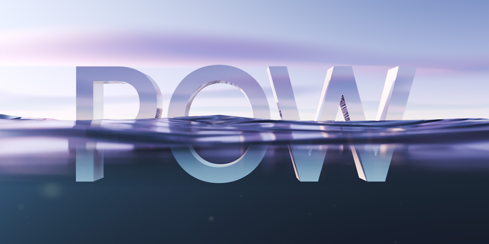

### 1.1.0 <small>- released 28.03.2024</small>

`new:`{: .label-new }

- Added underwater shader for water surface and world.
- Added new water surface material with custom light dispersing refraction shader.
- Mesh: added option to select an object to be able to shrinkwrap Ocean around it.
- Material: added water subsurface color, extinction and scattering parameters.
- Camera: added water edge that is shown whenever the camera is between the atmosphere and water.
- Wakes & Ripples: added option to select up to 3 objects to apply ripples.
- Underwater: added a way to select submerged objects to apply underwater shader.
- Underwater: added particles that give a more realistic feel.
- Underwater: added Blender underwater volumetric.

`improvements:`{: .label-improvements }

- Whenever PSA is turned on before adding ocean, Starlight Sun is automatically attached to the Sun slot.

### 1.0.2 <small>- released 18.12.2023</small>

`improvements:`{: .label-improvements }

- Added a convenient shortcut to quickly access the location of your presets. 

### 1.0.1 <small>- released 24.11.2023</small>

`new:`{: .label-new }

- Now you can apply Wakes to the objects in the water. It is a pattern of waves created by an object moving through water. 
